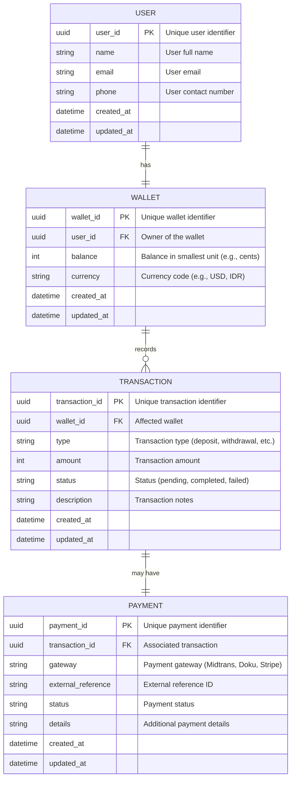

# Port And Adapter Architecture

```plaintext
├── cmd/
│   ├── api/                 # HTTP Server Entry Point
│   ├── grpc/                # gRPC Server Entry Point
│   ├── consumer/            # Kafka Consumer Entry Point
│   ├── publisher/           # Kafka Publisher Entry Point
│   ├── migrate/             # Database Migration Runner
│   └── job/                 # Background Jobs
│
├── config/
│   ├── config.yaml          # Main Configuration File
│   ├── config.local.yaml    # Local Overrides
│   ├── config.dev.yaml      # Dev Environment Config
│   ├── config.prod.yaml     # Production Config
│
├── internal/
│   ├── domain/              # Business Models & Rules
│   │   ├── wallet.go        # Wallet Entity & Methods
│   │   ├── transaction.go   # Transaction Entity & Methods
│   │   ├── user.go          # User Entity
│   │
│   ├── usecase/             # Application Logic
│   │   ├── wallet_service.go  # Wallet Business Logic
│   │   ├── payment_service.go # Third-Party Payment Logic
│   │
│   ├── ports/               # Interfaces for Adapters
│   │   ├── wallet_repository.go  # DB Interface for Wallet
│   │   ├── payment_gateway.go    # Interface for Midtrans, Doku, Stripe
│   │   ├── event_publisher.go    # Kafka Producer Interface
│   │   ├── event_consumer.go     # Kafka Consumer Interface
│   │
│   ├── adapters/            # Implementations of Ports
│   │   ├── postgres_wallet_repo.go  # PostgreSQL Adapter
│   │   ├── redis_cache.go           # Redis Adapter
│   │   ├── mongo_transaction_repo.go # MongoDB Adapter
│   │   ├── kafka_publisher.go        # Kafka Producer
│   │   ├── kafka_consumer.go         # Kafka Consumer
│   │   ├── midtrans_gateway.go       # Midtrans Payment Adapter
│   │   ├── doku_gateway.go           # Doku Payment Adapter
│   │   ├── stripe_gateway.go         # Stripe Payment Adapter
│
├── migrations/
│   ├── 001_create_wallets.up.sql
│   ├── 001_create_wallets.down.sql
│   ├── 002_create_transactions.up.sql
│   ├── 002_create_transactions.down.sql
│
├── api/
│   ├── rest/
│   │   ├── handlers/
│   │   │   ├── wallet_handler.go     # Wallet HTTP Handlers
│   │   │   ├── transaction_handler.go # Transaction HTTP Handlers
│   │   ├── routes.go                 # REST API Router
│   ├── grpc/
│   │   ├── wallet_service.proto      # gRPC Definition
│   │   ├── transaction_service.proto # gRPC Definition
│
├── tests/
│   ├── wallet_test.go      # Unit Test for Wallet Logic
│   ├── transaction_test.go # Unit Test for Transactions
│
├── docker-compose.yml     # Services for PostgreSQL, Redis, Kafka, etc.
├── Makefile               # Useful Commands (build, test, run)
├── go.mod                 # Go Module Definition
└── main.go                # Main Application Entry Point
```

# ERD
